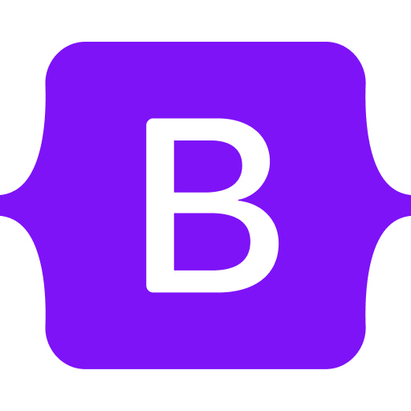

## 👋 Hi, I'm Colene!

## ⚡️ Quick Facts
- 👩🏻‍💻 I'm currently working on [yums-for-buns](https://github.com/encarnac/yums-for-buns)
- 🧠 I'm currently learning **Next.js**  
- 🎨 I enjoy working on creative projects involving design
- ✨ I read a lot of books and lift a lot of weights

## 👩🏻‍💻 Favorite Technology 

 
 

## 💬 Get In Touch
- 📬 Message me via [email](mailto:coleneencarnado@gmail.com)
- 👤 Connect with me on [LinkedIn](https://linkedin.com/in/encarnac)
- 🗂️ Checkout my [website](https://colenecodes.tech)
- 📝 Download my [resume](resume.pdf)

## 🚀 GitHub Stats

